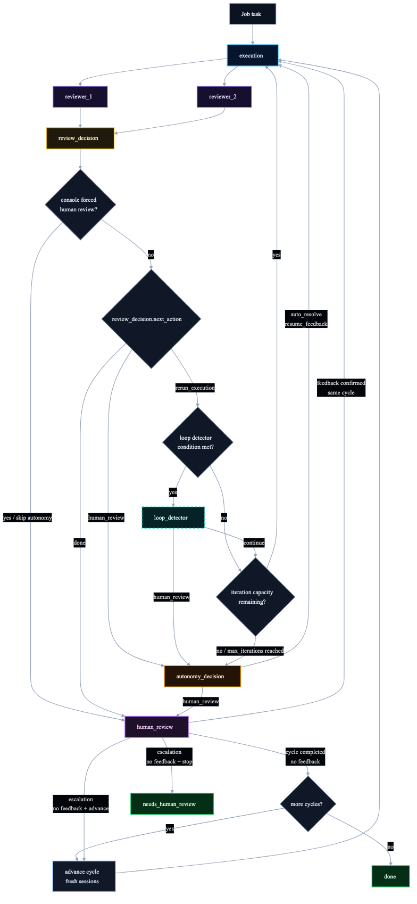

# council-agentflow

A YAML-driven Python CLI for governed, iterative multi-agent execution workflows.

`council-agentflow` runs review-driven, adjudicated iterations over OpenCode agent work. In each cycle, one agent executes, reviewers inspect the result, an adjudicator decides whether another iteration is worthwhile, and policy gates decide when autonomy is safe versus when a human should be involved.

The goal is to improve agent execution quality through controlled iterations, while reducing avoidable human interruptions and keeping agent autonomy bounded, reviewable, and auditable.

## Why this exists

Single-session agent loops often struggle to reliably discover their own mistakes. Adding subagents can help, but without hard workflow boundaries it is still unclear who reviews, who adjudicates, when a rerun is justified, and when the system should pause for human input. This project separates those responsibilities into named roles and file artifacts, making each iteration easier to inspect and control.

Use it when you want:

- repeatable multi-agent execution from YAML;
- review-driven iterations that improve output quality without turning into unbounded loops;
- independent reviewer roles instead of one self-reviewing agent;
- explicit adjudication before reruns;
- bounded autonomy for low-risk blockers;
- human escalation when external judgment or authority is required.

## Built on OpenCode

`council-agentflow` is backed by [OpenCode](https://opencode.ai/). OpenCode provides the agent runtime: tools, skills, model interaction, filesystem access, shell execution, and session handling for a single agent.

`council-agentflow` sits one level above that:

- OpenCode handles **intra-agent orchestration**: how one agent uses tools to do its work.
- `council-agentflow` handles **inter-agent workflow governance**: who runs first, who reviews, who adjudicates, when to rerun, when to stop, and when to escalate.

## Workflow at a glance



Diagram source: [`docs/diagrams/workflow.mmd`](docs/diagrams/workflow.mmd)

High-level flow:

1. `execution` performs the task and writes a plain-text output artifact.
2. `reviewer_1` and `reviewer_2` independently review that output.
3. `review_decision` adjudicates reviewer feedback and writes:
   - a JSON decision: `rerun_execution`, `human_review`, or `done`;
   - a merged plain-text review for the next execution step.
4. `rerun_execution` applies adjudicated feedback in another iteration of the current cycle.
5. `human_review` normally goes through `autonomy_decision` first, unless human review was forced from the console.
6. `done` ends automatic work for the current cycle, then pauses at a cycle-end human review gate before completing or advancing.
7. Agent sessions are reused within a cycle and reset between cycles.

For detailed state transitions, loop detection, human-review handling, and session behavior, see [`docs/workflow.md`](docs/workflow.md).

## Requirements

- Python `>=3.11`.
- `uv` is recommended; `uv.lock` is committed.
- [OpenCode](https://opencode.ai/) must be installed and available on `PATH` as `opencode`, unless `program.opencode_bin` overrides it.
- An OpenCode attach server and model/provider credentials must be configured. Start the OpenCode server from the target workspace/repository where agents should read files, modify files, and run commands. The sample config uses `attach_url: http://localhost:4096`.

## Quickstart

From a checked-out repo:

```bash
uv sync
uv run agentflow --help
```

Without `uv`, install the package in your preferred virtual environment and run the generated CLI directly:

```bash
python3 -m pip install -e .
agentflow --help
```

Create your own workflow config and jobs file. You can copy the examples as a starting point:

```bash
cp example.config.workflow.yaml my.workflow.yaml
cp example.jobs.yaml my.jobs.yaml
```

Then edit:

- `my.workflow.yaml`: shared runtime settings, prompt pack, models, iteration limits, output paths, and agent slots.
- `my.jobs.yaml`: the actual work items you want to run.

For most first runs, you can leave the `agents` block in `my.workflow.yaml` unchanged and only adjust `program` settings plus the jobs file.

Run your files:

```bash
uv run agentflow --config my.workflow.yaml --jobs my.jobs.yaml
```

Or, without `uv` after installation:

```bash
agentflow --config my.workflow.yaml --jobs my.jobs.yaml
```

Common arguments:

- `--config`: shared workflow configuration; contains `program` and `agents`.
- `--jobs`: project-specific jobs file; contains `jobs`.
- `--prompt-pack-path`: optional prompt packs directory containing `<prompt_pack>/pack.yaml`; overrides `program.prompt_pack_path`.
- `--verbose`: print rendered prompts and raw OpenCode JSON events.
- `--quiet`: suppress progress logs and print only errors plus final JSON.

## Minimal configuration shape

Common workflow config:

```yaml
program:
  opencode_bin: opencode
  attach_url: http://localhost:4096
  default_model: openai/gpt-5.5
  prompt_pack: implementation
  max_rounds: 1
  max_iterations_per_cycle: 10
  temp_dir: .agentflow-temp
  write_back: false

agents:
  execution: {}
  reviewer_1: {}
  reviewer_2: {}
  review_decision:
    merged_review_output_path_template: ${job_temp_dir}/${agent_output_name}-cycle-${cycle_number}-iteration-${iteration_number}.review.txt
  autonomy_decision:
    decision_report_output_path_template: ${job_temp_dir}/${agent_output_name}-cycle-${cycle_number}-iteration-${iteration_number}.report.md
  loop_detector: {}
```

Jobs file:

```yaml
jobs:
  - topic: api-service-design
    task: |
      Produce an API service execution plan with goals, scope, constraints,
      main steps, risks, and validation method.
    status: pending
```

The built-in prompt packs are:

- `implementation`: code implementation, scripts, tests, and bug fixes;
- `planning`: solution design, execution planning, documentation drafts, and architecture/process work.

You can also provide a custom prompt packs directory with `program.prompt_pack_path` or `--prompt-pack-path`; the selected pack is resolved as `<prompt_pack_path>/<program.prompt_pack>/pack.yaml`, and custom packs still use the fixed agent slots.

For full configuration defaults, prompt-pack resolution, agent slots, variant priority, and job behavior, see [`docs/configuration.md`](docs/configuration.md).

## Running jobs

Job status controls execution:

- `done` and `needs_human_review` are terminal and skipped.
- Any other status is executable.
- If `write_back: true`, the workflow writes back status changes: `running`, `done`, `needs_human_review`, or `failed`.

You can add `human_review: |` to a job while the workflow is paused. The workflow only injects that feedback after you explicitly confirm it should be used for the current round.

Use path-safe, unique `topic` values such as `api-service-design`; the topic becomes part of the temp output path.

## Safety and privacy

Run this in a clean branch, sandbox, or disposable clone first. Depending on OpenCode permissions and configuration, agents may read files, modify workspace files, and run local commands.

Task text, rendered prompts, repository context, and generated outputs may be sent to the configured model provider. Do not run the workflow on repositories containing secrets, customer data, private credentials, or other sensitive material unless you have reviewed and accepted that boundary.

## Outputs

By default, outputs are written under:

```text
<jobs-file-dir>/<temp_dir>/runs/<run_id>/<topic>/
```

Typical artifacts include:

- agent output files;
- `adjudication-memory.latest.txt`;
- merged review files from `review_decision`;
- `autonomy-decision-*.report.md` when `autonomy_decision` runs;
- final CLI JSON summary with completed, failed, and skipped jobs.

For artifact schemas, retry behavior, and troubleshooting, see [`docs/artifacts-and-troubleshooting.md`](docs/artifacts-and-troubleshooting.md).

## Known limitations

- **Higher token consumption**: review-driven iterations use multiple agent calls per iteration, plus adjudication and optional autonomy/loop-detection steps. This is more expensive than a single-agent run.
- **Fixed workflow**: the workflow topology is currently fixed around the built-in agent slots and step order. Prompt packs can change role semantics and prompt behavior, but they do not define an arbitrary custom workflow graph.

## Further documentation

- Workflow mechanics: [`docs/workflow.md`](docs/workflow.md)
- Configuration reference: [`docs/configuration.md`](docs/configuration.md)
- Autonomy decision policy: [`docs/autonomy-decision.md`](docs/autonomy-decision.md)
- Artifacts and troubleshooting: [`docs/artifacts-and-troubleshooting.md`](docs/artifacts-and-troubleshooting.md)
